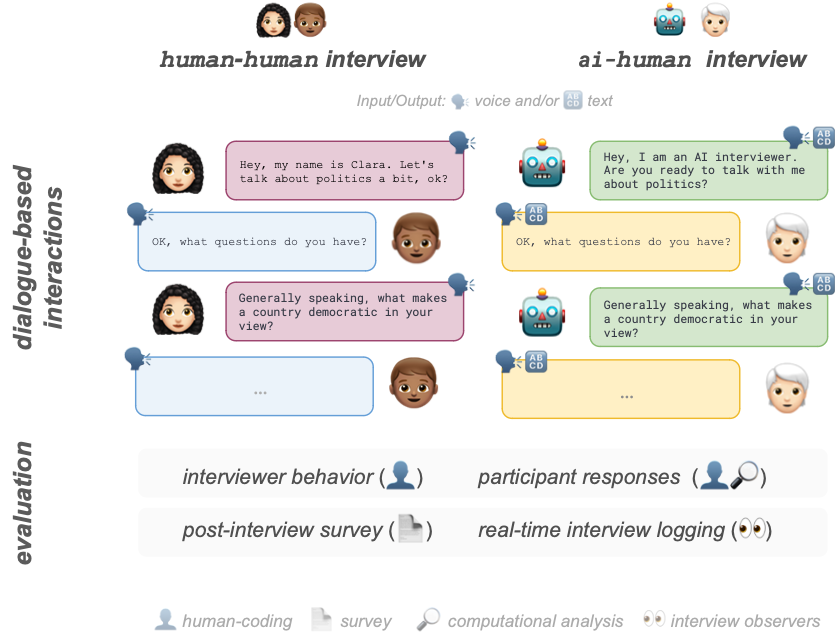

# AI Conversational Interviewing: Transforming Surveys with LLMs as Adaptive Interviewers
[](#)
[](#)
[](https://arxiv.org/abs/2410.01824)
<p align="center">

</p>

## Replication Material

This document contains the necessary materials and instructions to replicate the findings presented in our paper. We provide comprehensive information on the data sources, code, and analytical procedures used in our study. The replication package includes raw data files, data cleaning scripts, and analysis code. We encourage users to contact us with any questions or issues encountered during the replication process.

## Data Sources
 
We conducted two different types of interviews: human-human and AI-human. The raw responses from our participants and interviewers can be found in the following folders:

* **AI-Human Interviews**: All responses from the AI as interviewer
  - File: `ai_interviewing-responses.csv`
* **Human-Human Interviews**: All transcribed responses from human interviewers
  - Files: `interview-transcripted_i{1..5}.csv` (5 files, one for each interviewer)

## Application
We used Langchain and Chainlit for the development stack. The version used in the experiment can be found in the `app-v1` directory. For deployment, we used [Fly.io](https://fly.io/). Conversation data was stored using [Literal AI](https://getliteral.ai/).


### Setup
Install requirements from `requirements.txt` (in a virtual environment):

```sh
pip install -r requirements.txt
```

Version v1 uses ChatGPT, so you need to create a `.env` file with your OpenAI key:

```
OPENAI_API_KEY=<KEY>
```

Run [Chainlit](https://chainlit.io/) app:

```sh
chainlit run app.py
```


## Evaluation Sources

We employed various evaluation methods including qualitative surveys, annotations, and quantitative analysis of the conducted interviews:

1. **Post-interview Surveys**: 
   - Purpose: Addresses aspects such as clarity
   - Contents: Survey results and the codebook used
   - Location: `post_interview_surveys` folder

2. **Quality Coding on Interview Responses**: 
   - Purpose: Annotation of interview quality along dimensions described in the paper (e.g., engagement)
   - Contents: Merged annotations from two annotators
   - Note: Raw data from individual annotators available upon request (kept private for anonymization)
   - Location: `quality_coding` folder

3. **Observer Comments**: 
   - Purpose: Documentation of issues during interviews
   - Contents: Observer comments and the form used
   - Location: `observer_comments` folder

4. **Quantitative Text Analysis**: 
   - Purpose: Analysis of responses from AI and human interviews
   - Contents: Results of quantitative analysis
   - Location: `quantitative_analysis` folder

All results from these sources and scripts can be found in Table X in the paper.

## Scripts

1. **Interviewer Survey Scripts**: 
   - File: `analysis.R`
   - Purpose: Plotting evaluation results regarding response quality (e.g., grammaticality)

2. **Response Evaluation Scripts**: 
   - File: `analysis.R`
   - Purpose: Analysis of interviewer behavior (e.g., guidance)

3. **Quantitative Evaluation**: 
   - File: `quantitative-evaluation.ipynb`
   - Purpose: Quantitative text analysis of responses from AI- and human-conducted interviews

4. **AI Interviewer Interface**:
   - `./app-v1` Directory
   - Purpose: Code for running the interview interface with an AI interviewer
   - Contents: 
     - Setup instructions
     - Configuration files
     - Main application code
     - Documentation

## Plots

The provided scripts produce the plots presented in the paper. These can be recreated to reproduce the results using the data sources and evaluation sources through the provided scripts.

## Contact Information

If you have any questions, find an error, or encounter a missing file, please do not hesitate to contact us.

## Citation

```
@article{wuttke2024ai,
  author    = {Wuttke, Alexander and Aßenmacher, Matthias and Klamm, Christopher and Lang, Max M. and Würschinger, Quirin and Kreuter, Frauke},
  title     = {AI Conversational Interviewing: Transforming Surveys with LLMs as Adaptive Interviewers},
  journal   = {arXiv preprint},
  year      = {2024},
  eprint    = {2410.01824},
  archivePrefix = {arXiv},
  primaryClass = {cs.CL}
}
```
*Wuttke, A., Aßenmacher, M., Klamm, C., Lang, M. M., Würschinger, Q., & Kreuter, F. (2024). AI Conversational Interviewing: Transforming Surveys with LLMs as Adaptive Interviewers. arXiv preprint arXiv:2410.01824.*
